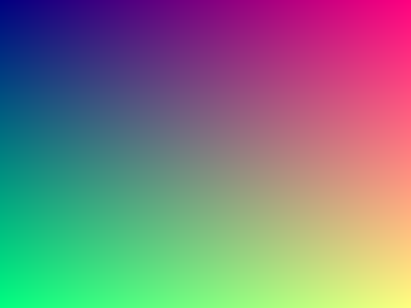

# Ray Tracer in C++


A ray tracer built from scratch in modern C++.

This project is my attempt to learn computer graphics by implementing everything myself instead of using existing graphics engines or rendering libraries. The long-term goal is to build a real-time CPU ray tracer while learning the mathematics and rendering techniques behind it.

---

# Demo

<p align="center">
    
</p>

<p align="center">
First image generated by the renderer.
</p>

---

# Features

### Engine

- [x] SDL3 Window
- [x] Real-time application loop

### Math

- [x] Vec3 Math
- [x] Ray generation

### Rendering

- [x] Gradient rendering
- [x] PNG image output

---

# Planned Features

### Rendering

- [x] Framebuffer
- [x] Camera
- [ ] Sky rendering
- [ ] Ray generation
- [ ] Sphere intersection
- [ ] Surface normals
- [ ] Lambert lighting
- [ ] Shadows
- [ ] Reflection
- [ ] Refraction
- [ ] Anti-aliasing
- [ ] Depth of field

### Engine

- [ ] FPS counter
- [ ] Camera movement (WASD)
- [ ] Mouse look
- [ ] Scene management

### Optimization

- [ ] Multithreading
- [ ] Bounding Volume Hierarchy (BVH)
- [ ] SIMD optimizations

### Future

- [ ] OBJ model loading
- [ ] Texture mapping
- [ ] HDR rendering
- [ ] Real-time path tracing

---

# Tech Stack

- C++20
- SDL3
- CMake
- GCC (MSYS2 UCRT64)
- stb_image_write

---

# Project Structure

```text
RayTracer/
│
├── assets/
│   └── gradient.png
│
├── include/
│   ├── vec3.h
│   ├── ray.h
│   ├── renderer.h
│   ├── camera.h
│   └── window.h
│
├── src/
│   ├── main.cpp
│   ├── vec3.cpp
│   ├── ray.cpp
│   ├── renderer.cpp
│   ├── camera.cpp
│   └── window.cpp
│
├── third_party/
│
└── CMakeLists.txt
```

---

# Building

### Requirements

- C++20 compiler
- CMake 3.20+
- SDL3
- MSYS2 UCRT64 (Windows)

```bash
git clone https://github.com/AdvaitPalve11/Simple-RayTracer
cd RayTracer

cmake -B build
cmake --build build

./build/RayTracer
```

---

# Why I'm Building This

I wanted to understand how a renderer works. Rather than using OpenGL or an existing game engine, I'm building the core components myself and adding new features one step at a time.

---

# References

- Ray Tracing in One Weekend — Peter Shirley
- Scratchapixel
- LearnOpenGL

---

# License

MIT License
